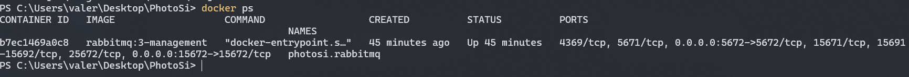

# PhotoSi Prova Tecnica
The project is a simplified order management platform which enables users to place or modify orders for a given product catalog and users. The system is built using a microservices architecture, with each service responsible for a specific domain: users, orders, products, and address book. The services communicate with each other using asynchronous messaging via MassTransit and RabbitMQ.
Each service owns its own SqlLite database and the data is persisted using Entity Framework Core.

<u>The project is not designed to be a production system and it is meant to be run locally for development and testing purposes.</u>

Here's a brief overview of the services:
### Orders Service

The Orders Service is responsible for managing orders, including creating, updating, and retrieving orders. It receives from the products service and users service the events related to the product and users CRUD operations and stores the data in its own database.<br>
The service enables the user to get the list of orders, get a specific order by ID, create a new order, update the existing order lines of a given order, and delete an order. For each operation the system checks the validity of the user and product associated to the order, ensuring that the user exists and the product is available in the catalog..<br>

### Users Service
The Users Service provides user management functionality, allowing all the CRUD operations on the user data. When a user is modified a synchronous check on the address book service to check the validity of the shipment address associated to the user is performed.<br>
All the updates on the user are sent asynchronously to the Orders Service using RabbitMQ as a message broker.

### Products Service
The Products Service manages the product catalog, allowing for CRUD operations on products. Whenever a product is updated a check on the category is performed assuring that every product is associated to a valid category. The service makes available checking what the available categories are with dedicated GET endpoints. <br>
It also sends events to the Orders Service when a product is created, updated, or deleted, allowing the Orders Service to keep its product data in sync.

### Address Book Service
The service expose only GET endpoints to retrive the list of available shipment addresses and the details of a specific address. It is used by the Users Service to validate the shipment address associated to a user when the user is modified.<br>

## How to run

1. **Prerequisites**<br>
   In order to run the project, you need to have the following installed on your machine:
   - [.NET SDK 8.0 or later](https://dotnet.microsoft.com/download)
   - [Docker](https://www.docker.com/get-started)

   Check that you have the .NET8 SDK installed by running:
   ```sh
   dotnet --list-sdks
   ```
   Check that you have Docker installed and running by executing:
   ```sh
   docker -v
   ```
   Docker is needed to run run the rabbit MQ container which enables the communication between services.

2. **Run RabbitMQ container locally**<br>
   Open a terminal and run the following command to start a RabbitMQ container with the management plugin enabled:
   ```sh
   docker run -d --name photosi.rabbitmq -p 5672:5672 -p 15672:15672 -e RABBITMQ_DEFAULT_USER=photosi -e RABBITMQ_DEFAULT_PASS=photosi rabbitmq:3-management
   ```
   If you don't already have the docker image locally available, the command will download it from the Docker Hub and it could take a few minutes.<br>
   Check that the RabbitMQ container is running by executing:
   ```sh
   docker ps
   ```
   The result should be like this:
   


2. **Test and Build the solution**
   Open a terminal on the root directory of the project, which contains the `PhotoSi.sln` file, and run the following command to build and test the solution:

   ```sh
   dotnet build PhotoSi.sln
   dotnet test PhotoSi.sln
   ```

3. **Apply database migrations**
   Each service applies migrations automatically on startup.

4. **Run the services**
   You can run each service individually:
   ```sh
   dotnet run --project src/PhotoSi.UsersService/PhotoSi.UsersService.csproj
   dotnet run --project src/PhotoSi.OrdersService/PhotoSi.OrdersService.csproj
   dotnet run --project src/PhotoSi.ProductsService/PhotoSi.ProductsService.csproj
   dotnet run --project src/PhotoSi.AddressBookService/PhotoSi.AddressBookService.csproj
   ```

   Or use Docker Compose if available.

5. **Access the APIs**
   By default, Swagger UI is enabled in development mode for each service at `http://localhost:<port>/swagger`.
